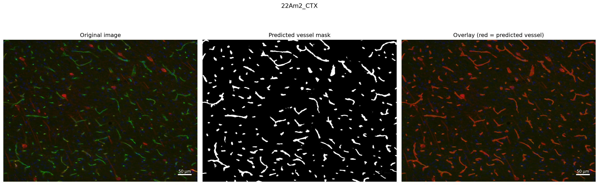
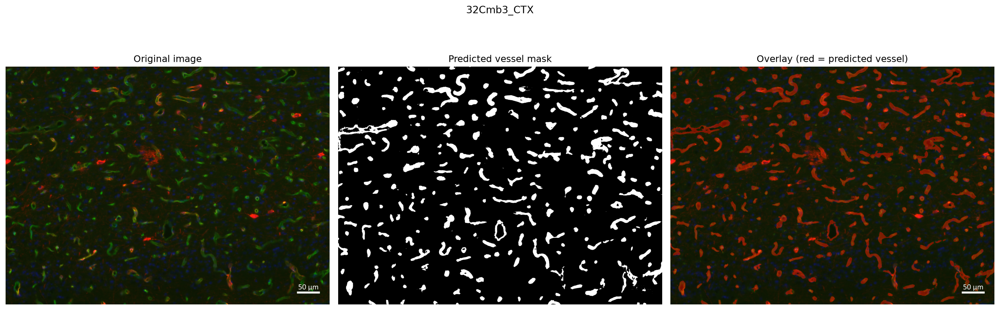
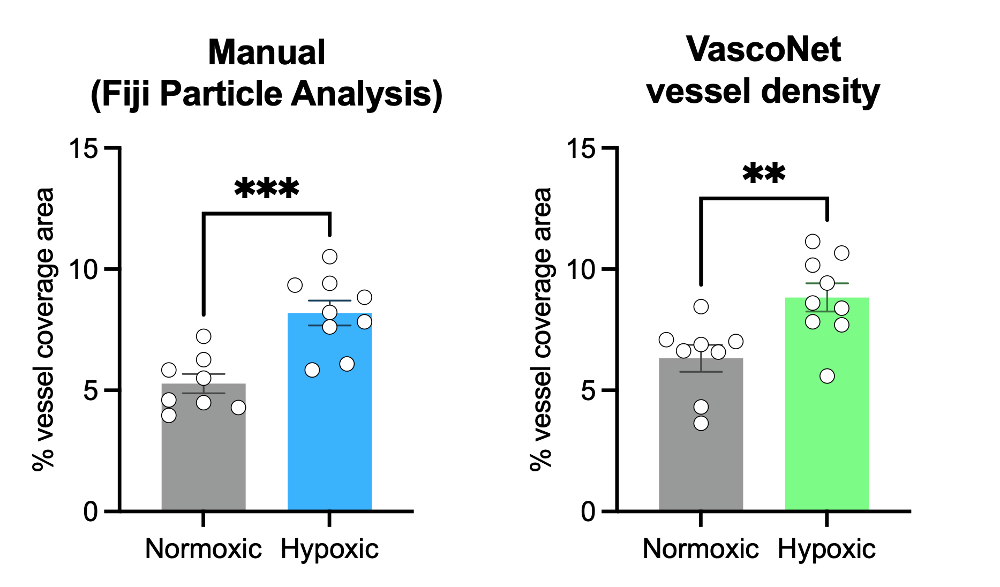
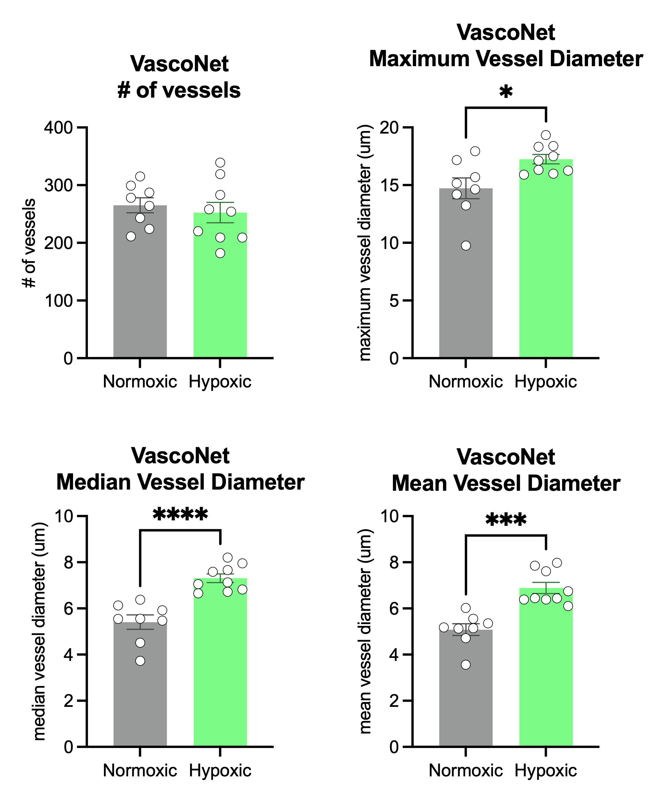

# VascoNet
### A U-Net model for automated vessel segmentation in brain immunofluorescence images

Accurate quantification of cerebrovascular histology is vital for assessing vascular phenotypes, yet experimental biologists are routinely burdened by manual image annotation — sacrificing weeks of time while introducing substantial batch effects from variability between annotators, staining batches, and imaging sessions. To overcome this, we developed **VascoNet**: a deep learning model for automated segmentation and quantification of blood vessels in brain immunofluorescence images.

**VascoNet** is built on a U-Net architecture with an EfficientNetB0 encoder pretrained on ImageNet, trained and validated on images from two brain regions (cortex and striatum) acquired across multiple experiments, experimenters, staining batches, and imaging setups (10x and 20x magnification). The model was trained on NVIDIA GPUs provided by the San Diego Supercomputer Center (SDSC) Triton Shared Computing Cluster (TSCC) at UC San Diego. VascoNet achieves human-level performance on previously unseen test images and was independently validated on a hypoxia mouse model, reliably detecting increases in vascular density and vasodilation in cortical brain sections — phenotypes driven by hypoxia-induced angiogenesis and vascular remodeling. VascoNet provides vascular biologists with a reliable, scalable alternative to manual vessel quantification, reclaiming hours of time for other experimental priorities.

**Validated metrics (5-fold cross-validation, 49 annotated images):**
- Mean absolute error in vascular area fraction: 0.0166
- Validation Dice coefficient: 0.8573
- Validation IoU: 0.7796

---

## Table of contents

- [Quick start — running predictions](#quick-start--running-predictions)
- [Output files](#output-files)
- [Requirements](#requirements)
- [Supported image types](#supported-image-types)
- [Training pipeline](#training-pipeline)
- [Model architecture](#model-architecture)
- [Dataset](#dataset)
- [Cross-validation results](#cross-validation-results)
- [Reproducing the training](#reproducing-the-training)
- [Citation](#citation)

---

## Quick start — running predictions

**1. Download the trained model weights**

Download `final_model.keras` from Zenodo: https://doi.org/10.5281/zenodo.21268546

**2. Install dependencies**

```bash
pip install -r requirements.txt
```

Or install manually:

```bash
pip install tensorflow numpy pillow scipy scikit-image matplotlib tqdm
```

**3. Run predictions on your images**

```bash
python predict.py \
    --images  path/to/your/images/ \
    --model   final_model.keras \
    --output  results/ \
    --cd31_channel green
```

Replace `green` with `red` or `blue` depending on which RGB channel contains
your CD31/vessel signal. **This must be specified manually** 

**4. (Optional) Add pixel sizes for morphology metrics in micrometers**

Fill in `pixel_sizes.csv` with your image filenames and pixel size (μm/px), or alternatively, you can use the `generate_pixel_sizes_csv.py` script. Then, add `--pixel_sizes pixel_sizes.csv` to the command above. See the template and instructions inside `pixel_sizes.csv`. If omitted, vessel morphology metrics, such as diameter and circularity are reported in pixels.

---

## Output files

Running `predict.py` creates the following in your output folder:

| File | Description |
|---|---|
| `measurements.csv` | One row per image: area fraction, vessel count, mean/median/max diameter, circularity, elongation |
| `overlays/stem_overlay.png` | Three-panel QC image: original \| predicted mask \| overlay |
| `prediction_log.txt` | Full processing log with warnings |

### Output column descriptions

| Column | Description |
|---|---|
| `area_fraction` | Vessel pixels / tissue pixels (0–1). Multiply by 100 for %. |
| `vessel_count` | Number of individual vessel segments detected |
| `mean_diameter_um` | Mean vessel diameter across all vessels (μm if pixel size provided) |
| `median_diameter_um` | Median vessel diameter |
| `max_diameter_um` | Maximum vessel diameter — primary marker of vasodilation |
| `std_diameter_um` | Standard deviation of vessel diameters |
| `mean_circularity` | Shape descriptor: 1.0 = perfect circle, approaching 0 = elongated |
| `mean_elongation` | Shape descriptor: 1.0 = circle, higher = more elongated |
| `cd31_channel` | Channel used for prediction (as specified by user) |

> **Always check the overlay images before using results in a publication.**
> Open `overlays/` and verify that predicted vessel regions (shown in red)
> align correctly with vessels in the original images. Very bright, blurry, or
> artifact-heavy images may give unreliable results and should be excluded.

---

## Requirements

- Python 3.9 or higher
- TensorFlow 2.15 or higher
- See `requirements.txt` for full dependency list

---

## Supported image types

- TIFF (`.tif`, `.tiff`) — recommended; best metadata preservation
- PNG (`.png`)
- JPEG (`.jpg`, `.jpeg`) — not recommended; lossy compression may affect results

Images of any size are supported. The tool:
- Handles images where CD31 is in any RGB channel (red, green, or blue)
- Automatically removes black border padding from ROI-masked images or images that go beyond tissue border (e.g., sections where tissue outside the region of interest is zeroed out)
- Tiles large images into 256×256 patches for model input, then stitches
  predictions back to full resolution

---

## Training pipeline

### Overview

The model was trained using a two-phase transfer learning strategy:

**Phase 1 (decoder warm-up, 15 epochs max):** The EfficientNetB0 encoder is
frozen (weights held at ImageNet-pretrained values). Only the decoder is
trained. This prevents large, noisy early gradients from degrading the
pretrained encoder features before the decoder has learned anything useful.

**Phase 2 (fine-tuning, 30 epochs max):** The encoder is unfrozen and the
entire network is fine-tuned end-to-end at a learning rate 100× smaller than
Phase 1 (1×10⁻⁵ vs. 1×10⁻³). This allows the encoder to specialize toward specific vessel features while retaining the general visual feature
representations learned from ImageNet.

Early stopping with `patience=5` (Phase 1) and `patience=8` (Phase 2) prevents
overfitting. The best-performing epoch's weights are restored automatically.

### Loss function

Combined Dice loss + Binary Cross-Entropy (BCE):

**Dice loss** directly optimizes pixel-level overlap between predicted and true
vessel masks, and is robust to class imbalance (vessel pixels are a small
minority of total tissue pixels). **BCE** provides stable gradients early in
training when Dice alone can be uninformative.

### Data preprocessing

**ROI → binary mask conversion:** Manual vessel tracings saved as ImageJ/Fiji
RoiSet.zip files are rasterized into binary pixel masks aligned to each image.
Each vessel ROI polygon is filled to produce a mask where 1 = vessel and
0 = background.

**Black border removal:** Images from striatum experiments where tissue outside
the anatomical ROI is zeroed out are automatically cropped to the tissue
bounding box before tiling, ensuring measurements reflect vessel area relative
to tissue area (not full image area including black padding).

**Tiling:** Full-resolution images are divided into 256×256 pixel tiles for
training (stride 192, overlapping) and prediction (non-overlapping). Tiles
containing >95% background (near-white or near-black pixels) are excluded.

**Augmentation (training only):** Spatial augmentation (random crops, flips,
rotations, mild elastic deformation) and photometric augmentation (brightness,
contrast, hue/saturation jitter) are applied on-the-fly each epoch. Validation
tiles receive no augmentation.

### Evaluation

Model performance was evaluated using slide-level 5-fold cross-validation
(39 train / 10 val per fold), where all splits are performed at the slide
level to prevent data leakage between tiles from the same source image.

The primary biological evaluation metric is **per-image area fraction absolute
error** — the difference between the model's automated vascular area fraction
measurement and the corresponding manual measurement. This directly reflects
the measurement error relevant to downstream biological analyses.

---

## Model architecture

U-Net with EfficientNetB0 encoder (ImageNet-pretrained):

```
Input: 256×256×3 tile (RGB, float32, [0,1])
    ↓
Rescaling(255)        [converts to EfficientNetB0's expected [0,255] range]
    ↓
EfficientNetB0 encoder (pretrained, 5 downsampling stages):
    128×128×96   ← skip connection 0
    64×64×144    ← skip connection 1
    32×32×240    ← skip connection 2
    16×16×672    ← skip connection 3
    8×8×1280     [bottleneck]
    ↓
Decoder (5 upsampling stages with skip connections):
    16×16×256
    32×32×128
    64×64×64
    128×128×32
    256×256×16
    ↓
Conv2D(1, 1) + sigmoid
    ↓
Output: 256×256×1 (per-pixel vessel probability)
```

Each decoder stage consists of: UpSampling2D (bilinear) → Concatenate (skip)
→ Conv2D → BatchNorm → ReLU → Conv2D → BatchNorm → ReLU.

**Total parameters:** ~10.1 million (~4.1M encoder, ~6.0M decoder)

---

## Dataset

**Training dataset:** 49 annotated brain IHC images (after exclusion of 2 images
with unacceptable quality: one out-of-focus, one with extensive preparation
artifacts).

| Property | Details |
|---|---|
| Brain regions | Cortex, striatum |
| Staining marker | CD31 |
| Annotation method | Particle Analysis and manual vessel tracing in ImageJ/Fiji (ROI sets) |
| Annotation source | Multiple annotators across multiple experiments from the Daneman lab |
| Imaging systems | Multiple setups (10x and 20x objectives) |
| Image dimensions | 3008×4096 (cortex), 5000–7500×5000–6000 (striatum, pre-crop) |
| Scale | 0.173 μm/px (cortex), pixel units maintained for striatum samples |

**Quality control:** Two cortex slides were excluded prior to training and documented
explicitly:
- **16Cm4**: excluded due to out-of-focus acquisition causing unreliable manual
  ground truth and systematic model over-prediction
- **16Cm5**: excluded due to excessive preparation artifacts (bubbles, staining
  noise) causing systematic model over-prediction

Images were split at the slide level for all train/val/test divisions to
prevent data leakage between tiles from the same source image.

---

## Cross-validation results

Performance was estimated using 5-fold cross-validation at the slide level.
All folds use identical hyperparameters and architecture.

See `results/cv_results.json` for the complete numeric summary and
`results/crossfold_summary.png` for training curves across all 5 folds.


| Metric | Mean (5-fold) | Std (5-fold) |
|---|---|---|
| Val loss (Dice + BCE) |0.2200|0.0322|
| Val Dice coefficient |0.8573|0.0210|
| Val IoU |0.7796|0.0297|
| Mean absolute error (MAE) |0.0166| |

---

## Reproducing the training

### Environment setup

This training pipeline was developed and run on the TSCC HPC cluster (San Diego
Supercomputer Center) using NVIDIA A100 GPUs. The same pipeline should run on
any Linux system with a CUDA-compatible GPU.

```bash
# Create conda environment and install dependencies
bash environment/setup_environment.sh

# Activate
conda activate vessel-seg
```

### Data preparation

Images and their corresponding ImageJ RoiSet.zip file annotations should be organized as:

```
data/
    images/   <stem>.tif
    rois/     <stem>_RoiSet.zip
```

One RoiSet.zip per image, matched by filename stem. The `roi_to_mask.py`
module converts ROI files to binary masks automatically during training.

### Running training

**Interactive (notebook):** open `notebooks/vessel_segmentation_walkthrough.ipynb`
in Jupyter Lab. This walks through every step of the pipeline cell-by-cell with
explanations and visualizations. Written to be educational and functional.

**Batch (5-fold cross-validation):** on an HPC system with SLURM:

```bash
sbatch training/submit_cv_training.sh
```

This runs the full 5-fold cross-validation plus a final model trained on all
slides, saving results to `results_v2/`. Requires ~100GB RAM and a single GPU.
Expected runtime: 8–12 hours depending on GPU.

### Key hyperparameters

| Parameter | Value | Rationale |
|---|---|---|
| Tile size | 256×256 px | Divisible by 32 (EfficientNetB0 has 5 downsampling stages) |
| Tile stride (train) | 192 px | Overlapping tiles increase training examples from limited slides |
| Tile stride (val) | 256 px | Non-overlapping for unbiased evaluation |
| Batch size | 8 | GPU memory constraint |
| Phase 1 learning rate | 1×10⁻³ | Decoder warm-up from random initialization |
| Phase 2 learning rate | 1×10⁻⁵ | Fine-tuning pretrained encoder at low LR |
| Phase 1 max epochs | 15 | With early stopping (patience=5) |
| Phase 2 max epochs | 30 | With early stopping (patience=8) |
| Min tissue fraction | 5% | Tile filter: excludes mostly-background tiles |
| Black threshold | 10 (gray value) | Threshold for detecting black ROI padding |

---

## Final model training

Following cross-validation, a final model (`final_model.keras`) was trained on
all 49 annotated slides with no held-out validation set. This is the model
distributed via Zenodo and used for all predictions described below.

Training on the full dataset follows the same two-phase schedule as each
cross-validation fold: Phase 1 (encoder frozen, decoder warm-up, up to 15
epochs) followed by Phase 2 (full fine-tuning at 1×10⁻⁵ learning rate, up to
30 epochs). Since no validation set is held out, early stopping is not applied
— epoch counts are informed by what the cross-validation folds typically
required before convergence.

The cross-validation results (see `results/cv_results.json`) serve as the
honest generalization estimate for this model: they describe expected
performance on unseen images using the same training recipe, evaluated across
all possible slide groupings.

---

## Biological validation on novel test data

To assess VascoNet's performance on entirely new, previously unseen images
acquired independently of the training set, we applied the final model to
**17 cortical brain sections** from a mouse model of hypoxia:

- **8 normoxia** — mice housed under standard oxygen conditions
- **9 hypoxia** — mice exposed to hypoxic conditions (8% O₂) for one week

Hypoxia is a well-established driver of angiogenesis and vascular remodeling
across organs including the brain. Cortical sections from hypoxic animals  show significantly increased vascular density and diameters relative to normoxic controls — providing a biologically grounded contrast to validate automated measurements.

### Vascular density: VascoNet vs. manual quantification

Vascular area fraction (% vessel coverage) was independently quantified
manually by a trained undergraduate researcher prior to automated analysis,
providing a blinded human benchmark. VascoNet's automated measurements
closely replicated the human quantifications, including detecting the expected
increase in vascular density in hypoxic animals. Representative images are shown below, where 22Am2_CTX is a normoxic sample, and 32Cmb3_CTX is a hypoxic sample.






### Additional morphology metrics from VascoNet

Beyond vascular density — the only metric quantified manually — VascoNet
additionally provides vessel morphology measurements that are difficult and time-consuming to manually measure at scale. These include vessel count, mean, median and
maximum vessel diameter (markers of vasodilation).



These additional metrics reflect the vascular remodeling response to hypoxia
beyond simple density changes, and are provided automatically by VascoNet
without any additional annotation or manual measurement.

### Images and pixel calibration

Images were acquired using an Axio Imager.M2 microscope with Axiocam 712 mono camera and Zen blue (v3.3.89.0000) software (Zeiss). Individual fluorescence channels were exported as separate TIFFs and merged into RGB composites for model input (CD31 in green). Scale: 0.1730 μm/px (289 px = 50 μm, confirmed from scale bar).

---

## Citation

If you use this tool in your work, please cite:

> [Citation to be added upon publication]

The trained model weights are permanently archived at:
> Zenodo DOI: https://doi.org/10.5281/zenodo.21268546
---

## License

Creative Commons Attribution 4.0 International<br>
MIT

---

## Contact

Sean Harvey, PhD<br> 
Postdoctoral Researcher, Daneman Lab<br>
Depts. of Pharmacology & Neuroscience<br>
University of California, San Diego<br>
email: ssharvey@health.ucsd.edu

Lab Website: https://www.danemanlab.com/
